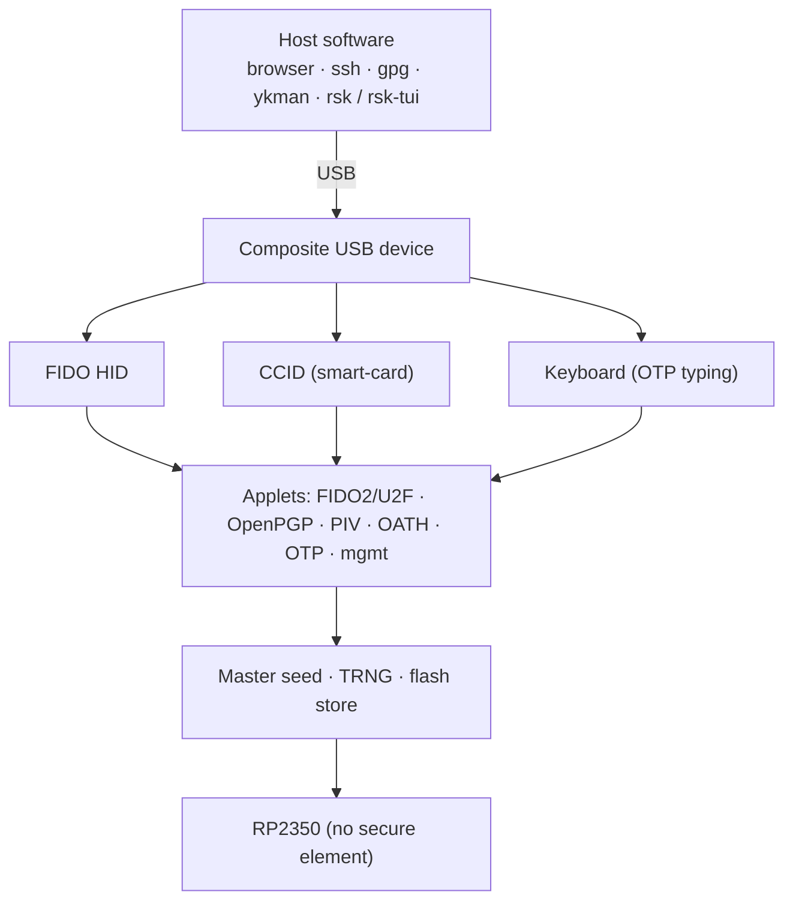
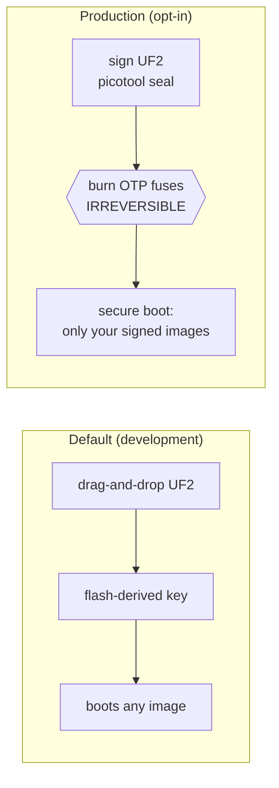

# RS-Key

[](https://github.com/bitmerse/RS-Key/actions/workflows/ci.yml)
[](https://github.com/bitmerse/RS-Key/actions/workflows/deep-checks.yml)
[](https://bitmerse.github.io/RS-Key/)
[](https://www.bestpractices.dev/projects/14195/silver)

> **This is the [bitmerse](https://github.com/bitmerse/RS-Key) fork of
> [TheMaxMur/RS-Key](https://github.com/TheMaxMur/RS-Key).** It adds the
> `rgb_gpio` LED backend (a 3-pin common-anode RGB LED on any three GPIOs) used
> by the bitmerse Romu board. The releases page and the OpenSSF badge refer to
> the upstream project.

**An open-source hardware passkey.** Flash one file onto a Raspberry Pi
**RP2350** board and it becomes a USB security key: passkey logins in the
browser, `ssh` and `git` signing, GPG, PIV, and TOTP codes.

| | |
|---|---|
| **What this is** | Firmware. A `.uf2` file you drop onto a board. Nothing here is for sale. |
| **What you need** | Any RP2350 board (from about $5) and a USB cable. No soldering, no programmer, no toolchain. |
| **What you get** | A USB authenticator your browser, `ssh`, `gpg` and `ykman` already know how to talk to. |


> **This project is experimental.** It has had no external security audit, the
> RP2350 is not a secure element, and a stolen board is only as strong as the
> optional OTP / secure-boot hardening you have applied to it. Don't use it to
> guard credentials you can't afford to lose or have stolen. Read the
> [threat model](docs/threat-model.md) and [limitations](docs/limitations.md)
> before trusting it with anything real.

## Quick start

From a fresh board to a passkey login. Nothing to build.

### Easy way: use the web flasher

Use the [RS-Key Web Flasher](https://rskey.fob.wtf/) for a guided browser flow.
It can download, verify, sign, and flash the firmware.

**Browser requirement:** Flashing requires a desktop Chromium-based browser,
such as Google Chrome or Microsoft Edge.

### Manual way

1. Download the newest **`rs-key-<version>-default.uf2`** from the
   [releases page](https://github.com/TheMaxMur/RS-Key/releases/latest).
2. Hold the board's **BOOT** button while you plug it in. A drive named
   `RP2350` appears.
3. Copy the `.uf2` onto that drive. The board reboots as a security key.
4. Go to [webauthn.io](https://webauthn.io) and register a passkey. The browser
   walks you through setting a PIN the first time, then asks for a touch: press
   the **BOOT** button.

Which file to take:

| Your board | Image |
|---|---|
| Most RP2350 boards, 4 MB flash | `default` |
| 2 MB flash (Seeed XIAO RP2350, Waveshare RP2350-Zero-CM) | `2mb` |
| 16 MB flash (TenStar RP2350-USB) | `16mb` |
| Waveshare RP2350-Touch-LCD-2.8 | `display` |

The other ten images are behaviour variants (post-quantum algorithms, the FIPS
profile, `alwaysUv`, PIN hardening). Full table, plus how to verify the cosign
signature and reproduce the build yourself: [docs/releases.md](docs/releases.md).

The longer walkthrough, with the PIN, `ssh` and `gpg` steps, is
[docs/quickstart.md](docs/quickstart.md). On Linux the smart-card half needs a
little host setup first: [docs/linux.md](docs/linux.md).

Once it is flashed you can configure it from a GUI instead of a terminal:
**[PicoForge](https://github.com/librekeys/picoforge)** (third-party, from the
librekeys project) reads the device's state and writes the same config surface the
`rsk` CLI does — see [Host tools](#host-tools).

<p align="center">
  <br>
  <sub>A board straight out of step 3, in PicoForge: the default <code>1209:0001</code> identity, no PIN yet, boot mode still <code>Development</code></sub>
</p>

The demo below runs on a board with a screen. A plain RP2350 board behaves the
same way, with two differences: the host asks for the PIN instead of the device,
and you confirm with the physical button instead of an on-screen one.

<p align="center">
  <br>
  <sub>Step 4 on the <code>display</code> image: the PIN and the Approve/Deny happen on the device's own screen</sub>
</p>

## What it supports

- **FIDO2 / WebAuthn / U2F** — passkeys, two-factor logins, `ssh ed25519-sk`
- **OpenPGP card 3.4** — `gpg` signing, decryption, authentication (EC + RSA)
- **PIV** — X.509 smart-card via PKCS#11 (or `ykman piv`, which needs the opt-in `VIDPID=Yubikey5` build)
- **OATH** — TOTP / HOTP codes (`ykman oath`, Yubico Authenticator — both need the opt-in `VIDPID=Yubikey5` build)
- **Yubico-style OTP** — four slots, plus a USB-keyboard interface that types the code
- **Seed backup** — export the FIDO master seed as BIP-39 / SLIP-39 words
- **At-rest soft-lock** — keep the FIDO seed in flash encrypted to a key only you hold
- **On-device audit journal** and **enterprise (org-provisioned) attestation**
- **Post-quantum FIDO2 (experimental)** — implements all three ML-DSA schemes:
  ML-DSA-44 (COSE −48), ML-DSA-65 (−49) and ML-DSA-87 (−50), on an in-tree,
  stack-optimized FIPS 204 implementation that streams the matrix A so even the
  category-5 set fits the RP2350. Advertising them in getInfo is off by default
  because some shipped browsers reject an unknown algorithm id. This is not a
  FIPS-validated module.

Capacities are flash-bound and generous (e.g. up to 256 resident passkeys,
255 OATH accounts, 24 PIV slots, 4 OTP slots); details are in the
[feature guides](docs/guides/) and [build options](docs/build.md).



## What it does not protect against

- **Physical / lab attacks** — decapping, microprobing, fault injection beyond
  the on-chip glitch detectors, power/EM side channels, and flash-emulation
  TOCTOU. The RP2350 is not a secure element; if your threat model includes a
  funded lab, buy a certified key.
- **A compromised host with the device unlocked** — like any security key, it
  will perform operations you have authorized while plugged in and unlocked.
- **Loss of secrets without the optional hardening** — at-rest protection only
  becomes meaningful after you fuse the OTP master key (see Production, below).

Full reasoning: [docs/threat-model.md](docs/threat-model.md).

## Hardware

Any RP2350 board with USB. Developed and tested on the **Waveshare RP2350-One**
(WS2812 status LED on GPIO16; boards without an LED run fine). A different flash
size, LED pin, or presence-button GPIO is a one-line build knob. Details:
[docs/hardware.md](docs/hardware.md).

<p align="center">
  <br>
  <sub>Three boards, one firmware: stick · trusted display · RP2350-One</sub>
</p>

## Documentation

The docs live in [docs/](docs/) and are published as a site:
**<https://bitmerse.github.io/RS-Key/>**.

| | |
|---|---|
| [Quick start](docs/quickstart.md) | flash, enroll, first login |
| [Hardware](docs/hardware.md) | supported boards and build knobs |
| [Build options](docs/build.md) | every flag: VID/PID presets, version, touch, PQC, FIPS profile |
| [Production setup](docs/production.md) | OTP fuses + secure boot, step by step (**irreversible**) |
| [Feature guides](docs/guides/) | FIDO2, SSH, OpenPGP, PIV, OATH, OTP, backup, soft-lock, LED, audit, … |
| [Threat model](docs/threat-model.md) · [Limitations](docs/limitations.md) | what it protects against, and what it does not |
| [Architecture](docs/architecture.md) · [`unsafe` audit](docs/unsafe.md) | how it's built; every `unsafe` site |
| [Testing](docs/testing.md) · [Interop](docs/interop.md) | host tests, fuzzing; real-tool results |
| [Linux setup](docs/linux.md) · [Motivation](docs/motivation.md) | pcscd/udev/polkit; why this exists |

## Build it yourself

The release images are reproducible, so you can rebuild any of them bit for bit
([docs/releases.md](docs/releases.md)). To build your own:

```sh
git clone https://github.com/bitmerse/RS-Key && cd RS-Key
nix develop                       # toolchain, picotool, host tools, everything

cargo build --release -p firmware
scripts/pt.sh target/thumbv8m.main-none-eabihf/release/firmware firmware-pt.elf   # fence the key's storage off the bootloader
picotool uf2 convert firmware-pt.elf -t elf firmware.uf2

# hold BOOTSEL, plug the board in, then flash, either way:
cp firmware.uf2 /Volumes/RP2350/                    # macOS drag-and-drop; Linux: the mounted RP2350 volume
picotool load -v firmware.uf2 && picotool reboot    # more robust; verifies the write (use if cp flakes)
```

Re-plug the board and it enumerates as a composite USB authenticator. The default
build requires a **physical touch** (the BOOTSEL button) for FIDO operations;
build with `--features no-touch` for a no-touch build (the automated test
suites need it). Every compile-time knob, including the flash size, LED pin and
USB identity, is in [docs/build.md](docs/build.md).

## Development setup

`nix develop` is the whole setup: Rust with the `thumbv8m.main-none-eabihf`
target, `picotool`, the Python host stack, and the security tooling. One command
is the merge gate, and CI runs exactly the same script:

```sh
nix develop -c ./scripts/check.sh   # fmt, clippy, host tests, firmware builds, audit, deny, gitleaks
```

See [CONTRIBUTING.md](CONTRIBUTING.md) and [docs/testing.md](docs/testing.md).

### No board? Run the emulator

`tools/emu` runs the same `crates/rsk-*` applet code a real key runs — FIDO2/U2F,
PIV, OpenPGP, OATH — over sockets instead of USB, so the protocol test suites
work with nothing plugged in:

```sh
nix develop -c ./scripts/emu-suites.sh          # every suite that needs no board
cargo run --manifest-path tools/emu/Cargo.toml --target "$HOST" -- --display
```

`--display` opens the trusted screen in a window: the whole flow, not a viewer,
so the Approve/Deny ceremony can be tried with a mouse. On Linux, `--usbip`
attaches it to the kernel as a *real* USB device, which is how a browser, `ykman`
or `gpg` reach it.

It is **not** a security key: no secure boot, no OTP root, no fuses, and the seed
sits in a file. It emulates behaviour, not the device. See
[`tools/emu/README.md`](tools/emu/README.md).

## Production / secure boot (irreversible — read first)

By default the firmware flashes by drag-and-drop and roots its at-rest
encryption in a key derived on the device. An optional, opt-in path hardens
that: it fuses a random master key into RP2350 OTP and enables secure boot so
the board runs only images you sign.



These steps **burn one-time-programmable fuses**: they cannot be undone, they
change your reflash workflow forever (signed images only), and a mistake can
brick the board. They are also what makes a stolen board's flash dump useless.
Read [docs/production.md](docs/production.md) end to end before running anything.

## Host tools

Inside the dev shell two commands are on `PATH`:

- **`rsk`** — the device CLI (Python): `rsk status`, `rsk backup`, `rsk lock`,
  `rsk secure-boot`, `rsk otp`, `rsk fido`, `rsk led`, `rsk reboot`, … (`rsk --help`)
- **`rsk-tui`** — a terminal dashboard for day-to-day reads and a few in-band
  actions ([guide](docs/guides/tui.md); `rsk-tui --demo` needs no hardware)

Without the dev shell, `rsk` also runs on a plain Python ≥ 3.9 toolchain via
[uv](https://docs.astral.sh/uv/) or pip — `uvx --from ./tools rsk status`,
`uv tool install ./tools`, or `pipx install ./tools`. Details and the native-lib
notes are in [tools/README.md](tools/README.md).

Separately, **`rsk-wipe`** is a RAM-only flash-erase *image* you flash
deliberately to wipe a board for clean-slate testing — it is built and flashed
like firmware, not run from `PATH` ([rsk-wipe/README.md](rsk-wipe/README.md)).

Third-party: **[PicoForge](https://github.com/librekeys/picoforge)** (from the
librekeys project) is a desktop GUI that configures an RS-Key over the same `phy`
record `rsk hw` writes — see the
[host protocol](docs/protocol.md#11-integration-notes-for-picoforge).

Also third-party, and a developer tool rather than a setup one:
**[Telesma](https://github.com/go-ctap/app)** is a desktop workbench for
inspecting and managing a local FIDO2/CTAP authenticator, built on
[`go-ctap/ctap`](https://github.com/go-ctap/ctap) — an independent CTAP 2.0–2.3
client stack, which is what makes it interesting here: a second opinion on what
this firmware answers, from a parser that is not libfido2 or python-fido2. It has
not been run against RS-Key yet; it is `⏳` in the
[interop matrix](docs/interop.md#fido2--webauthn--u2f).

## Limitations (short list)

- **No secure element.** OTP + secure boot is real hardening, but physical
  attacks are out of scope.
- **Seed backup covers the deterministic identity only** — resident passkeys,
  OpenPGP and PIV keys do not survive a board swap.
- **No brainpoolP512r1 / X448 / Ed448** OpenPGP curves (no mature `no_std` Rust
  arithmetic yet); brainpoolP256r1 and P384r1 are supported.
- The default USB identity is **RS-Key's own** pid.codes id `0x1209:0x0001`;
  the YubiKey USB identity that `ykman` / Yubico Authenticator auto-recognize is
  the opt-in `VIDPID=Yubikey5` build, not for distribution.

Details and reasoning: [docs/limitations.md](docs/limitations.md).

## License

**AGPL-3.0-only** — see [LICENSE](LICENSE), [NOTICE](NOTICE), and
[COMPLIANCE.md](COMPLIANCE.md). RS-Key is a from-scratch Rust reimplementation of
the AGPL-3.0-**only** [pico-keys](https://github.com/polhenarejos) firmware
family (pico-fido / pico-openpgp / pico-keys-sdk) by Pol Henarejos; the upstream
grant is version-3-only, so RS-Key inherits it and so must forks. Not affiliated
with or endorsed by Yubico, Nitrokey, or Raspberry Pi. See [motivation](docs/motivation.md).

<sub>The name: **R**aspberry **S**ecurity **Key**, and a nod to Rust. Nothing to
do with RSA. The crates and the CLI shorten it to `rsk`.</sub>
